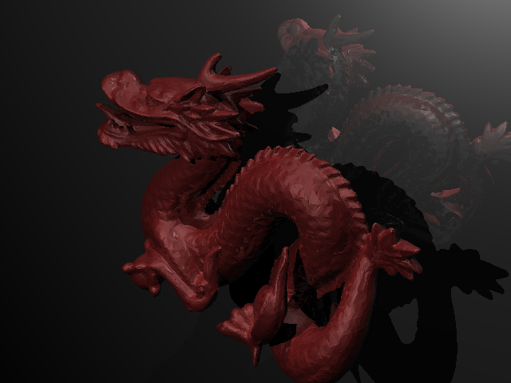
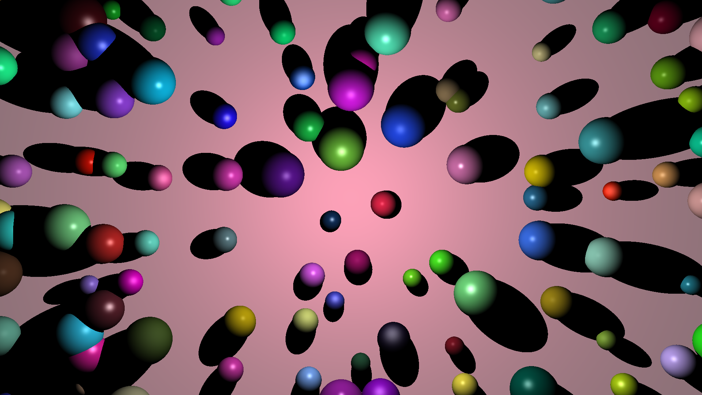
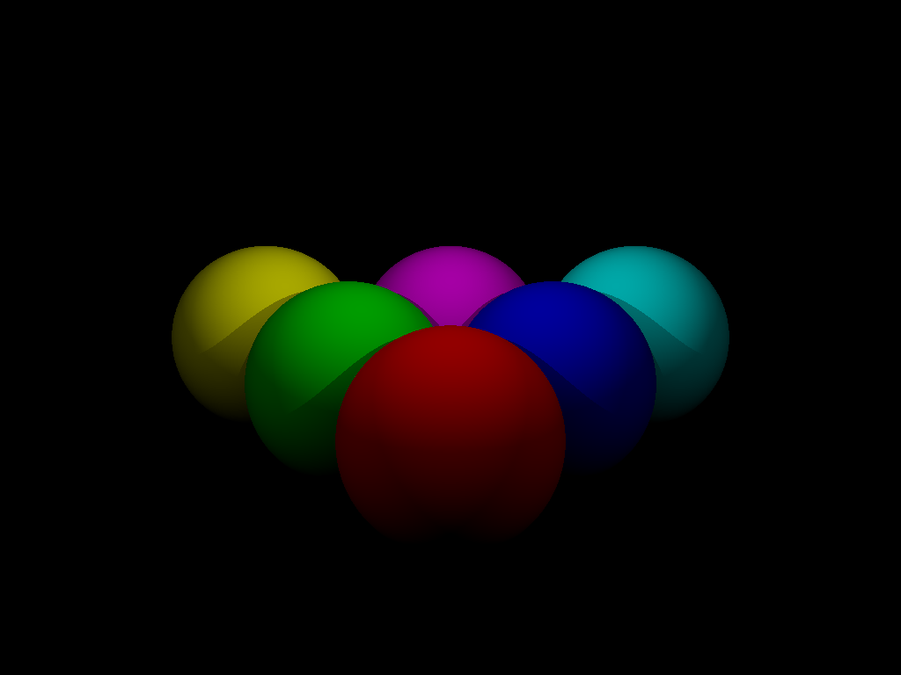
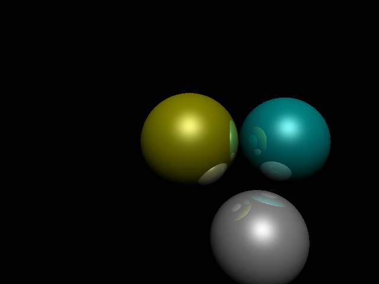

# Ray Tracer

Un moteur de rendu 3D développé en Java qui génère des images photoréalistes à partir de descriptions de scènes textuelles.



## Description du projet

Ce ray tracer implémente les techniques fondamentales de synthèse d'image par lancer de rayons. Pour chaque pixel de l'image finale, un rayon est tracé depuis la caméra virtuelle à travers ce pixel. Le programme calcule ensuite les intersections avec les objets de la scène et détermine la couleur résultante en fonction de l'éclairage.

### Fonctionnalités

- Génération d'images à partir de fichiers de description de scène
- Support de plusieurs formes géométriques : sphères, triangles et plans
- Système de gestion de vertex pour définir des triangles par référence
- Modèle d'illumination de Lambert pour la réflexion diffuse
- Support de deux types de sources lumineuses : directionnelles et ponctuelles
- Lumière ambiante globale
- Calcul des normales pour un rendu réaliste
- Export au format PNG

### Architecture

Le projet est organisé en plusieurs packages :

- `com.raytracer` : Classes principales (Scene, Camera, RayTracer, lumières)
- `com.geometry` : Formes géométriques (Point, Vector, Sphere, Triangle, Plane)
- `com.parsing` : Parser pour les fichiers de scène
- `com.imaging` : Gestion des couleurs

## Installation

### Prérequis

- Java JDK 8 ou supérieur
- Maven (optionnel, compilation manuelle possible)

### Compilation

**Avec javac :**

```bash
cd raytracer
javac -d target/classes -sourcepath src/main/java src/main/java/com/raytracer/Main.java
```

**Avec Maven :**

```bash
cd raytracer
mvn clean compile
```

### Copie des ressources

Les fichiers de scène doivent être accessibles au programme :

```bash
# Windows PowerShell
Copy-Item -Path "src/main/resources/*" -Destination "target/classes/" -Recurse -Force

# Linux/macOS
cp -r src/main/resources/* target/classes/
```

## Utilisation

### Avec le JAR exécutable (recommandé)

```bash
java -jar raytracer/target/raytracer-1.0.jar <chemin-vers-fichier-scene>
```

Exemples :

```bash
# Chemin absolu
java -jar raytracer/target/raytracer-1.0.jar "C:\chemin\vers\ma_scene.scene"

# Chemin relatif
java -jar raytracer/target/raytracer-1.0.jar raytracer/src/main/resources/scenes/final.scene
```

### Avec les classes compilées

```bash
java -cp raytracer/target/classes com.raytracer.Main <chemin-vers-fichier-scene>
```

### Tester toutes les scènes

Un script PowerShell est fourni pour générer les images de toutes les scènes et les comparer aux images de référence :

```powershell
.\run-all-tests.ps1
```

Ce script :
- Génère les images pour chaque jalon (2-6) et les scènes finales
- Compare automatiquement chaque image avec sa cible (quand disponible)
- Affiche un rapport de différences de pixels

L'image générée sera sauvegardée à l'emplacement spécifié dans le fichier de scène.

## Format des fichiers de scène

Les fichiers de scène utilisent un format textuel simple. Chaque ligne commence par un mot-clé suivi de ses paramètres.

### Commentaires

```
# Ceci est un commentaire
```

Les lignes vides sont ignorées.

### Paramètres de l'image

**Dimensions de l'image :**
```
size <largeur> <hauteur>
```
Exemple : `size 640 480`

**Fichier de sortie :**
```
output <nom-fichier>
```
Exemple : `output rendu.png`

### Caméra

```
camera <x> <y> <z> <lookX> <lookY> <lookZ> <upX> <upY> <upZ> <fov>
```

Paramètres :
- `x y z` : Position de la caméra
- `lookX lookY lookZ` : Point visé (look at)
- `upX upY upZ` : Vecteur indiquant la direction du haut
- `fov` : Angle de vue en degrés

Exemple :
```
camera 0 0 4 0 0 0 0 1 0 45
```
Caméra en (0, 0, 4), regardant vers (0, 0, 0), avec le haut aligné sur l'axe Y et un angle de 45°.

### Lumières

**Lumière ambiante :**
```
ambient <r> <g> <b>
```
Valeurs RGB entre 0 et 1.

Exemple : `ambient 0.1 0.1 0.1`

**Lumière directionnelle :**
```
directional <dx> <dy> <dz> <r> <g> <b>
```
- `dx dy dz` : Direction d'où provient la lumière
- `r g b` : Couleur/intensité de la lumière

Exemple : `directional 1 1 1 1 1 1`

**Lumière ponctuelle :**
```
point <x> <y> <z> <r> <g> <b>
```
- `x y z` : Position de la source lumineuse
- `r g b` : Couleur/intensité de la lumière

Exemple : `point 4 0 4 0.5 0.5 0.5`

### Matériaux

Les matériaux sont définis avant les objets qui les utilisent.

**Couleur diffuse :**
```
diffuse <r> <g> <b>
```
Exemple : `diffuse 1 0 0` (rouge)

**Couleur spéculaire :**
```
specular <r> <g> <b>
```
Exemple : `specular 0 0 0` (pas de réflexion spéculaire)

### Objets géométriques

**Sphère :**
```
sphere <cx> <cy> <cz> <rayon>
```
- `cx cy cz` : Centre de la sphère
- `rayon` : Rayon de la sphère

Exemple :
```
diffuse 1 0 0
specular 0 0 0
sphere 0 0 0 1
```

**Système de vertex pour triangles :**

Déclarer le nombre maximum de vertex :
```
maxverts <nombre>
```

Définir un vertex :
```
vertex <x> <y> <z>
```

Les vertex sont numérotés à partir de 0 dans l'ordre de déclaration.

Créer un triangle :
```
tri <index1> <index2> <index3>
```

Exemple complet :
```
maxverts 4
vertex -1 -1 0
vertex  1 -1 0
vertex  1  1 0
vertex -1  1 0

diffuse 0 1 0
tri 0 1 2
tri 0 2 3
```

**Plan :**
```
plane <px> <py> <pz> <nx> <ny> <nz>
```
- `px py pz` : Point appartenant au plan
- `nx ny nz` : Vecteur normal au plan

Exemple :
```
diffuse 0.5 0.5 0.5
plane 0 -1 0 0 1 0
```

## Exemple de fichier de scène complet

```
# Configuration de base
size 800 600
output scene.png

# Caméra
camera 0 2 5 0 0 0 0 1 0 60

# Lumières
ambient 0.2 0.2 0.2
directional 1 1 1 0.8 0.8 0.8
point -2 3 2 0.5 0.5 0.5

# Sphère rouge
diffuse 1 0 0
specular 0.3 0.3 0.3
sphere 0 0 0 1

# Sphère bleue
diffuse 0 0 1
specular 0.3 0.3 0.3
sphere 2 0 -1 0.8

# Plan (sol)
diffuse 0.7 0.7 0.7
specular 0 0 0
plane 0 -1 0 0 1 0
```

## Documentation

La documentation complète du projet est disponible au format JavaDoc.

### Accéder à la JavaDoc

Ouvrez le fichier suivant dans votre navigateur :

```
raytracer/doc/index.html
```

Ou depuis un terminal :

```bash
# Windows PowerShell
start raytracer/doc/index.html

# Linux/macOS
open raytracer/doc/index.html
```

### Régénérer la JavaDoc

Si vous modifiez le code source, vous pouvez régénérer la documentation :

```bash
cd raytracer
javadoc -d doc -sourcepath src/main/java -subpackages com -encoding UTF-8 -charset UTF-8 -author -version
```

## Structure du projet

```
Ray_Tracer/
├── raytracer/
│   ├── src/
│   │   ├── main/
│   │   │   ├── java/
│   │   │   │   └── com/
│   │   │   │       ├── geometry/
│   │   │   │       ├── imaging/
│   │   │   │       ├── parsing/
│   │   │   │       └── raytracer/
│   │   │   └── resources/
│   │   │       └── scenes/
│   │   └── test/
│   ├── doc/             # Documentation JavaDoc
│   ├── target/
│   └── pom.xml
├── imgcompare/
└── README.md
```

## Quelques rendus

Voici quelques exemples d'images générées par le ray tracer :

### Scène finale (1920x1080)



### Scène Dragon (640x480)


### Éclairage diffus (tp51-diffuse)



### Réflexions (tp62-2)



## Fonctionnalités implémentées

- Formes géométriques : sphères, triangles, plans
- Éclairage : lumières directionnelles et ponctuelles
- Modèle de Lambert (réflexion diffuse)
- Modèle de Blinn-Phong (réflexion spéculaire)
- Calcul des ombres
- Réflexions récursives (avec profondeur configurable)
- Rendu multi-threadé pour de meilleures performances
- Structure d'accélération BVH (Bounding Volume Hierarchy)

## Cadre 

Projet développé dans le cadre du cours de Conception Orientée Objet à l'Institut Mines Telecom Nord Europe.
